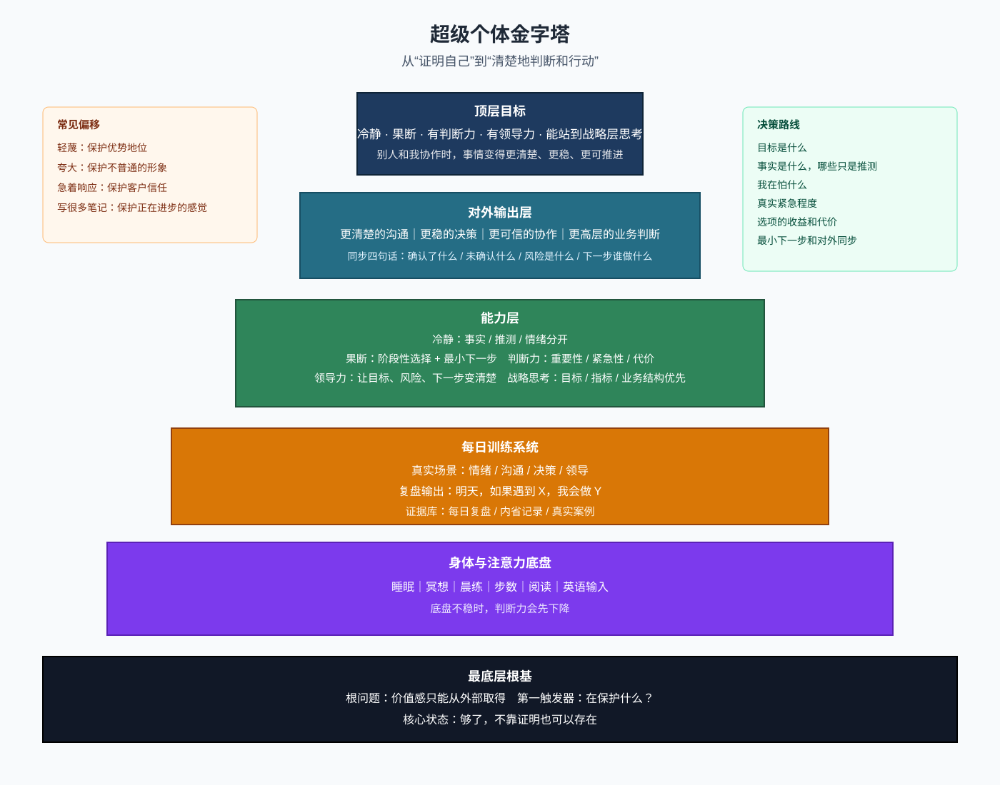
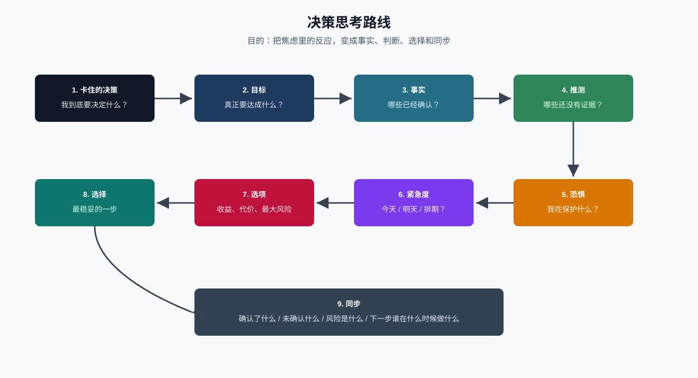

# 超级个体手册 v4.1
> 最后更新：2026-05-13

这不是一本说明书，也不是用来收藏洞察的手册。它是一套每天可执行的操作系统：白天捕捉线索，晚上整理证据，第二天做一个具体动作。

如果觉得这本太重，日常只看：[[执行手册]]

---

## 0.总架构

Draw.io 架构图文件：`super-individual-pyramid.drawio`



金字塔从下到上是：

1. 最底层根基：价值感、触发器、“够了”的状态。
2. 身体与注意力底盘：睡眠、冥想、晨练、步数、阅读、英语输入。
3. 每日训练系统：真实场景、复盘输出、证据库。
4. 能力层：冷静、果断、判断力、领导力、战略思考。
5. 对外输出层：更清楚的沟通、更稳的决策、更可信的协作、更高层的业务判断。
6. 顶层目标：成为冷静、果断、有判断力、有领导力、能站到战略层思考的人。

**一句话版本：**
我不是靠变得更有用来证明自己不可替代，而是在真实场景里训练自己：先看见保护，再做清楚的判断和行动。

### 0.1 每天怎么用

不要晚上硬想“今天用了哪个洞察”。按这个顺序操作：

1. **早上设一个抓手**：今天最重要的一件事是什么？我今天带着哪个问题过一天？
2. **白天只留痕迹**：情绪、卡住、被提醒、想证明、想逃避时，记一句“场景 + 第一反应”。
3. **晚上回收线索**：从白天痕迹里选一个最有训练价值的，不要求每个都分析。
4. **提炼成动作**：最后必须写出“明天，如果遇到 X，我会做 Y”。

这套系统的重点不是提高觉察时长，而是降低捕捉成本。先能留下痕迹，再谈稳定觉察。

---

## 1.目标画像

我要迭代成的人，不是更会证明自己的人，而是：

| 能力 | 具体表现 | 反面信号 | 每天怎么练 |
|------|----------|----------|------------|
| 冷静 | 情绪上来时，能分清事实、推测和恐惧 | 第一反应是轻蔑、防御、急着解释 | 问：我在保护什么？ |
| 果断 | 信息不完美时，也能做阶段性选择 | 无限等确认，或为了缓解焦虑立刻乱动 | 写出最小下一步 |
| 判断力 | 能区分重要、紧急、可等待 | 把客户压力等同于事情真的紧急 | 问：真实代价是什么？ |
| 领导力 | 让别人知道目标、现状、风险、下一步 | 自己脑子里反复推演，但没有同步清楚 | 用四句话对外同步 |
| 战略思考 | 先看目标、指标、业务结构，再看执行 | 一上来就进入技术实现和排期 | 先问：这件事服务什么增长目标？ |

**检验标准：**
不是我觉得自己变强了，而是别人和我协作时，事情变得更清楚、更稳、更可推进。

---

## 2.根基系统

### 2.1 根问题

**所有问题的根：价值感只能从外部取得。**

英语优势、利他、做系统、写手册，这些本身没问题。但如果驱动力是“这样别人才不会觉得我可有可无”，那每个动作都在安抚焦虑，而不是在建设能力。

这本手册本身也可能变成自欺。如果只是写进来、不往外拿，它就是“积累仪式感”最精致的版本。

### 2.2 第一触发器

**四字触发词：在保护什么？**

当轻蔑、焦虑、防御、急着证明冒出来，第一反应问这四个字。不是事后复盘，是那一秒。

常见保护对象：

| 反应 | 可能在保护 |
|------|------------|
| 轻蔑别人 | 我的优势地位 |
| 夸大数字 | 我不是普通人的形象 |
| 急着响应客户 | 客户对我的信任 |
| 不信任开发测试 | 我对结果失控的恐惧 |
| 写很多笔记 | 我正在进步的感觉 |

### 2.3 核心状态：“够了”

妻子对我好，天气好，微风，感觉自己在往好的方向走。那一刻没有外部观众，没有需要证明的东西。

那个状态一直在，不需要挣。下次它出现，不要立刻扫描下一个缺陷。

**动作：停一分钟，不优化，不解释，不找下一个问题。**

---

## 3.自欺检测

| 模式 | 表现 | 识别信号 | 真实处理 |
|------|------|----------|----------|
| 今天无所谓 | “明天再做也一样” | 用未来的自己替今天承担代价 | 今天做一个最低版本 |
| 降级替代 | 用条件很差的版本假装在做 | 维持“我在努力”的感觉 | 要么认真做，要么承认今天不做 |
| 积累仪式感 | 记录、整理、写文档 | 输入的满足感替代了行为改变 | 写出一个真实场景动作 |

**硬标准：**
今天有没有留下一个真实线索，并把它变成明天的一个动作？如果没有，复盘就容易变成仪式。

---

## 4.每日训练系统

### 4.1 每日底盘

| 时间 | 内容 | 训练的不是 |
|------|------|------------|
| 7:30 | 起床，不碰手机 | 不把注意力第一秒交出去 |
| 7:30-7:40 | 冥想 | 练“看见反应” |
| 7:40-7:55 | 晨练 | 练身体底气 |
| 8:40-9:05 | 阅读 | 练认知输入 |
| 通勤 | 英语有声书 | 维持长期优势，但不拿它证明自己 |
| 12:20-13:00 | 散步 | 把身体从工作里拔出来 |
| 到家-22:00 | 阅读 + 复盘 | 把洞察落到明天动作 |
| 22:30 | 停屏幕 | 保护睡眠 |
| 23:00 | 睡觉 | 第二天的判断力来自这里 |

### 4.2 休息日底线

休息日不是“什么都可以”的许可证，是内容不同但底线不变的一天。

不可动：

| 项目 | 说明 |
|------|------|
| 手机不进卧室 | 睡眠质量，和工作无关 |
| 冥想 5-10 分钟 | 可以缩短，但不跳过 |
| 睡觉不超过 00:30 | 可以晚一点，不能熬夜 |

完全放开：

- 打游戏、看剧、直播、什么都不干
- 不阅读、不英语、不晨练
- 睡懒觉到 8、9 点
- 和妻子随便做什么

休息日自检：
**这件事是在让我休息，还是在让我逃避？**

---

## 5.能力模块

### 5.1 冷静：事实、推测、情绪分开

冷静不是没有情绪，是情绪来了以后不立刻相信它。

**工作卡住时先写三列：**

| 已确认事实 | 我的推测 | 我的情绪 |
|------------|----------|----------|
| 已发生、可验证 | 可能是这样，但还没证据 | 怕、急、烦、轻蔑、防御 |

**例子：华为 NolPay 登录问题**

| 已确认事实 | 我的推测 | 我的情绪 |
|------------|----------|----------|
| 华为实际发布过，但被拒绝 | 拒绝原因可能和谷歌不完全一样；版本可能不一致 | 怕客户失去信任，怕被指责 |

### 5.2 果断：阶段性选择 + 最小下一步

果断不是拍脑袋。果断是承认信息不完美，然后给出一个可回滚、可验证的下一步。

**果断公式：**

> 基于目前已确认事实，我先选择＿＿＿。  
> 如果＿＿＿被证实不成立，我再切换到＿＿＿。  
> 现在最小下一步是＿＿＿。

### 5.3 判断力：先判断问题，再处理问题

遇到问题先问：

1. 这件事真正要达成什么结果？
2. 它今天必须处理吗，还是明天确认后更稳？
3. 客户有压力，是否等于事情真的紧急？
4. 直接行动的代价是什么？
5. 等待确认的代价是什么？

**判断力的一个关键句：**
压力是信号，不一定是优先级。

### 5.4 领导力：让事情变清楚

领导力不是压住别人，也不是替所有人扛住焦虑。领导力是在混乱里让事情变清楚。

**对外同步四句话：**

1. 现在确认了什么。
2. 还没确认什么。
3. 风险是什么。
4. 下一步谁在什么时候做什么。

**华为 NolPay 同步示例：**

> 目前确认：华为版本不是未发布，而是提交后被拒。  
> 还需确认：拒绝原因是否与谷歌问题一致，以及当前包和谷歌版本是否一致。  
> 风险：如果直接重提，可能再次被拒，反而延长发布时间。  
> 下一步：明早让开发确认版本和拒绝原因，我再同步处理方案。

### 5.5 战略思考：先站到更高一层

我目前的一个关键差距：容易从执行层、技术实现层开始想问题，而不是先站到业务和组织层判断问题。

**遇到项目讨论时，先问五层：**

| 层级 | 问题 |
|------|------|
| 战略层 | 这件事服务什么战略意图？增长、收入、留存、效率还是风险控制？ |
| 业务层 | 这条业务靠什么增长？收入从哪里来？关键指标是什么？ |
| 产品层 | 产品体系应该怎样支撑业务目标？ |
| 项目层 | 当前项目要解决哪一个关键瓶颈？ |
| 执行层 | 技术、设计、排期、人员怎么落地？ |

**RTA 项目提醒：**

详细笔记：[[2026-05-13-RTA项目改进计划]]

不要一上来想技术实现。先问：这个项目的战略意图是什么？如果核心是增长，那中心思想应该先是收入增长，再倒推 CRM 看板、产品体系、项目管理和技术实现。

**深度思考的动作：**
先写“问题本身是什么”，再顺着问题往下追三层。没有追到目标、指标和代价之前，不急着给方案。

---

## 6.决策路线

当我卡住一个决策，就按这个顺序写，不跳步：

专项手册：[[决策思考手册]]

Draw.io 决策路线文件：`decision-thinking-route.drawio`



**最小输出：**

- 我选择什么。
- 我为什么这么选。
- 我需要谁确认什么。
- 我什么时候对外同步。

---

## 7.复盘操作系统

复盘不是日记，也不是晚上靠记忆审判自己。复盘是训练数据回收。

模板文件：`每日复盘/_模板.md`

### 7.1 复盘的三段操作

| 时间 | 做什么 | 标准 |
|------|--------|------|
| 早上 | 写今天主线和一个要带着的问题 | 给大脑一个抓手 |
| 白天 | 留下 1-3 条线索 | 场景 + 第一反应即可 |
| 晚上 | 从线索里选一个整理成动作 | 明天能执行 |

**为什么改：**
洞察和自欺都发生在白天的瞬间。晚上很难凭空回忆，所以模板不再问“今天用了哪个洞察”，而是问“今天留下了哪些线索”。

### 7.2 白天捕捉格式

只写一句，不分析：

> 时间/场景：发生了什么；我的第一反应是什么。

例子：

- 跟领导讨论 RTA：发现自己一直想技术实现，没有先想战略目标。
- 客户催发布：第一反应是急着响应，怕失去客户信任。
- 别人说英语不行：第一反应是轻蔑，像是在保护我的优势地位。

### 7.3 晚上回收格式

晚上只选一个最值得训练的线索，问：

1. 这件事暴露了什么能力差距？
2. 它属于哪一层：情绪、沟通、决策、战略、执行？
3. 我过去默认的反应是什么？
4. 更好的操作方式是什么？
5. 明天一个具体动作是什么？

### 7.4 学习内容复盘

当一天里有领导提醒、项目讨论、读书输入时，用这个结构：

| 问题 | 目的 |
|------|------|
| 事件是什么 | 定位真实场景 |
| 我学到什么 | 把输入说清 |
| 暴露什么能力差距 | 找训练点 |
| 是执行层还是战略层问题 | 防止陷入细节 |
| 更高一层的目标是什么 | 建立业务判断 |
| 明天补一个什么动作 | 变成行为 |

### 7.5 三类素材

| 类型 | 记录什么 | 喂给哪个能力 |
|------|----------|--------------|
| 自欺类 | 今天无所谓、降级替代、积累仪式感、急着证明 | 冷静和自我诚实 |
| 沟通失误类 | 我说了什么，对方可能听到什么 | 领导力和沟通 |
| 决策/战略卡住类 | 事实、推测、恐惧、目标、指标、下一步 | 果断、判断力和战略思考 |

### 7.6 内省记录格式

文件位置：`内省 / YYYY-MM-DD-一句话标题.md`

```md
## [日期] [一句话标题]
**类型：** 自欺 / 沟通失误 / 决策卡住

### 发生了什么（2-3句，客观）

### 我的第一反应

### 在保护什么

### 事实、推测、情绪

### 下次触发条件 -> 我会做什么
```

---

## 8.成长阶段

### 第一阶段：2026.05-2026.08

**主攻：在真实情绪冒出来的那一秒，认出它在保护什么。**

这不是新增很多目标。所有训练都服务于一个动作：真实时刻里看见保护。

| 能力 | 行动 | 检验标准 |
|------|------|----------|
| 情绪觉察（主攻） | 轻蔑、焦虑、防御出现时，当场问“在保护什么” | 累积10次真实时刻记录 |
| 身体 | 晨练 + 全天8000步 | 连续21天不断 |
| 认知 | 读 Inner Game of Tennis | 能描述 Self 1 / Self 2 在自己身上的表现 |
| 英语 | 通勤听 + 午间走路说10分钟录音 | 每天坚持，不计效果 |
| 沟通 | 每晚沟通复盘 | 累积10条真实记录后提炼高频坑 |
| 决策 | 卡住时走决策路线 | 累积5个真实工作案例 |
| 战略思考 | 项目讨论后写“目标-指标-结构-动作” | 累积5个业务/项目案例 |

### 第二阶段：2026.09-2026.11

情绪觉察稳定后，加思维模型深化和英语主动输出。

- 穷查理宝典：每读一个模型，找真实场景套用。
- 英语：从听转为读马斯克传英文原书。
- 自我反省素材积累够后，提炼个人沟通高频坑。

### 第三阶段：2026.12-2027.06

- 用芒格框架分析真实投资决策。
- 沟通高频坑提炼后，形成个人沟通原则。
- 把决策案例整理成个人判断力案例库。

---

## 9.当前阅读和输入

| 书/内容 | 状态 | 时间段 | 读法 |
|---------|------|--------|------|
| Inner Game of Tennis | 进行中 | 早上 8:40-9:05 | 找 Self 1 / Self 2 在自己身上的具体表现 |
| 马斯克传（英文有声，Audible） | 进行中 | 通勤 | 听，不求全懂 |
| 超级沟通者 | 下一本 | Inner Game 读完后，早上 | 结合内省记录读，找自己的高频坑 |
| Steve Jobs 传（英文有声，Audible） | 下一个音频 | 马斯克传听完后，通勤 | 听，不求全懂 |
| The Knowledge Project | 备用音频 | 通勤 | 无传记可听时替代 |
| 穷查理宝典 | 等待 | 第二阶段 | 慢读，每个模型找真实场景 |
| Psychology of Money | 等待 | 穷查理宝典读完后 | 结合投资和决策案例 |

---

## 10.版本记录

| 版本 | 日期 | 改动内容 | 改动原因 |
|------|------|----------|----------|
| v1.0 | 2026-05-08 | 初始建立 | — |
| v1.1 | 2026-05-08 | 沟通复盘模板新增「触发记忆」字段 | 事后填写时场景已模糊 |
| v2.0 | 2026-05-09 | 重写：加入根源分析、触发词、复盘输出格式改为行动脚本 | 手册本身变成积累仪式感，需要把输入变成行动 |
| v2.1 | 2026-05-09 | 复盘模板剥离到独立文件 _模板.md，脚本动态读取 | 模板更新只改一个文件，次日自动生效 |
| v2.2 | 2026-05-10 | 新增第4节休息日规则 | “休息日”被用作绕过底线的借口 |
| v2.3 | 2026-05-10 | 章节编号改为阿拉伯数字；修复休息日节号重复、能力层表格行列错乱 | 格式规范化，同时修复遗留结构问题 |
| v3.0 | 2026-05-10 | 重组为四层结构（根基/日常系统/成长主线/自我反省）；阅读计划内嵌至成长主线；Work Case Study替换为自我反省 | 原结构三种层次平铺混排，章节间关系不清 |
| v3.1 | 2026-05-12 | 新增目标画像、决策能力路线、领导力同步框架；加入华为 NolPay 登录问题作为真实案例 | 目标从情绪觉察扩展到冷静、果断、判断力和领导力 |
| v4.0 | 2026-05-12 | 改为具像化架构手册；新增 Mermaid 架构图、能力模块、决策流程图、证据库结构 | 原手册阅读时仍偏抽象，需要一眼看清系统如何运转 |
| v4.1 | 2026-05-13 | 改为操作手册；复盘系统从“晚上回忆洞察”改为“白天捕捉线索、晚上回收证据”；新增战略思考模块和 RTA 项目提醒 | 旧模板依赖晚上回忆，难以捕捉白天瞬间；当前训练需要从执行层上升到业务和战略层 |
